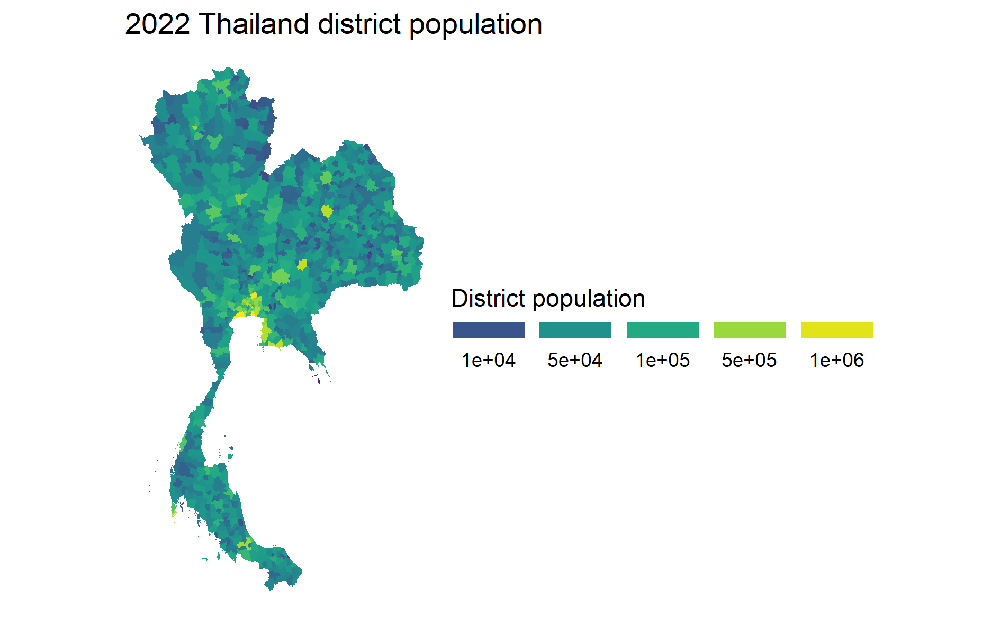

# maps-TStas
maps-TStas created by GitHub Classroom

# 2022 Thailand District Population Map

The purpose of this map is to display how population varies across the district regions in Thailand. The data used is from 2022.

## Thailand shape data

The Thailand shape data, which gives the boundary information for various spatial units (province, district, sub-district, etc) can be downloaded from here:

<https://data.humdata.org/dataset/cod-ab-tha>

Specifically, I used the 'tha_adm_rtsd_itos_20210121_shp.zip' file.

District is a subset of province, and it was more interesting to plot the data at the district level, which is found in the 'tha_admbnda_adm2_rtsd_20220121.shp' file. The spatial units being displayed in the maps are regional districts.

## Thailand population data for 2022

The Thailand population data came from the same 'Humanitarian Data Exchange' (HDX) source:

<https://data.humdata.org/dataset/cod-ps-tha>

Specifically, I used the 'tha_admpop_adm2_2022.csv' file.

## Output of choropleth (png)

